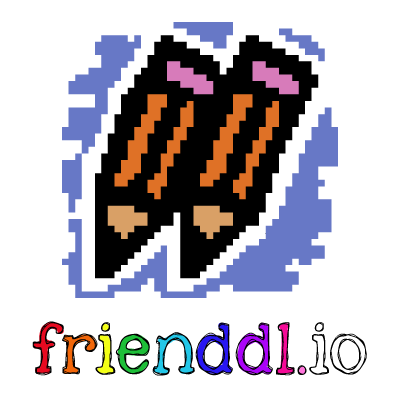

<p align="center">
  
</p>

[](https://github.com/blakegearin/frienddlio/blob/main/LICENSE.md)
[](https://github.com/blakegearin/frienddlio/releases)

frienddl.io is a [Chrome extension](https://developer.chrome.com/extensions) to find friends on [skribbl.io](https://skribbl.io/), a free online multiplayer drawing & guessing game.

**Status:** Unpublished, still in beta

## Getting Started

1. Clone repository:

    ```sh
    git clone https://github.com/blakegearin/frienddlio.git
    ```

2. Navigate to the directory: `cd frienddlio`
3. Open the Extensions page in Chrome: `chrome://extensions/`
4. Turn on developer mode in the top right corner
5. Click "Load unpacked" at the top left
6. Select the `frienddlio` directory

## Contributions

This project is open for anyone to contribute or raise issues. You can view open issues [here](https://github.com/blakegearin/frienddlio/issues) and feature requests [here](https://github.com/blakegearin/frienddlio/projects/1).

Follow these steps to contribute:

1. Fork this repository
2. Follow the [Getting Started](#getting-started) steps
3. Make changes
4. Test changes by running the application locally
5. When satisfied with changes, open a pull request with screenshots of your testing evidence

## Credit

* Font in logo: [Kimberly Geswein](http://www.kimberlygeswein.com/)
* GIFs and background image: [skribbl.io](https://skribbl.io/)
* JS library: [jQuery](https://jquery.com/)
* CSS framework: [Bootstrap](https://getbootstrap.com/)
